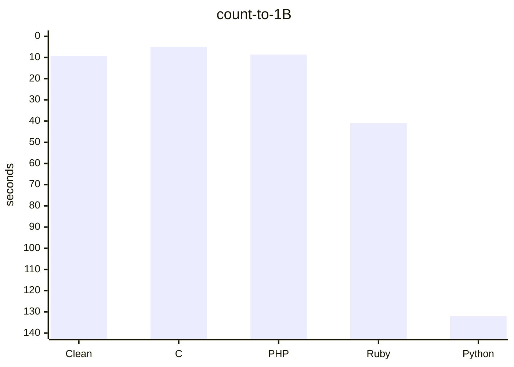
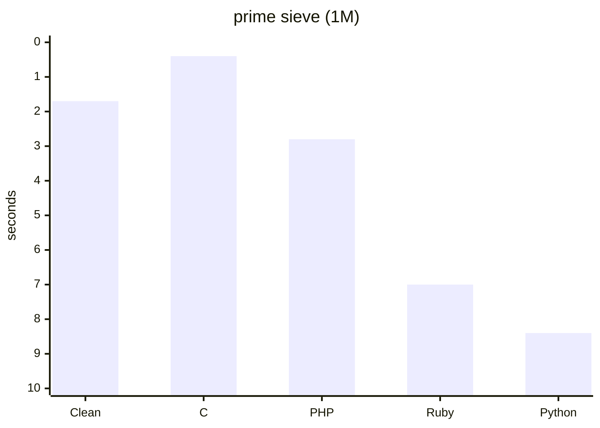
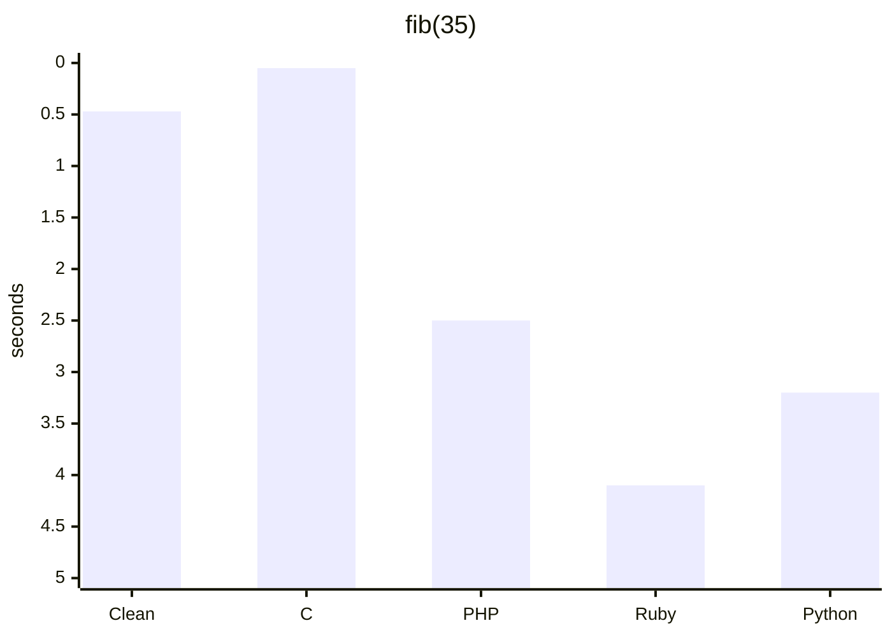
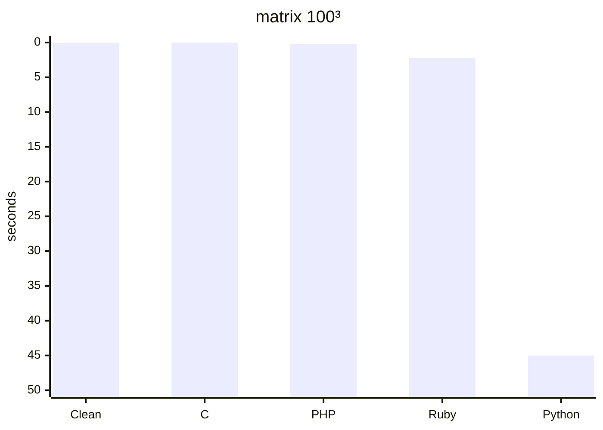

# Clean

**Clean** to natywny kompilator języka systemowego z wcięciową składnią, statycznym typowaniem i zarządzaniem pamięcią przez ownership & borrowing — bez garbage collectora. Kompiluje źródło wprost do x86-64 assembly, bez LLVM.

> Status: **v0.2.0** — kompilacja źródła → x86-64 asm → `as` + `ld` → ELF.  
> `clean run` działa jak Python, `clean build` tworzy natywną binarkę.

---

## Spis treści

- [Dlaczego Clean?](#dlaczego-clean)
- [Instalacja](#instalacja)
- [Szybki start](#szybki-start)
- [Przykłady](#przykłady)
- [Narzędzia CLI](#narzędzia-cli)
- [Benchmark](#benchmark)
- [Poradnik](/docs/TUTORIAL.md)
- [Struktura projektu](#struktura-projektu)
- [Licencja](#licencja)

---

## Dlaczego Clean?

| Cecha | Opis |
|-------|------|
| Składnia | Wcięcia zamiast `{}` i `;` — jak Python, ale kompilowany do natywnego kodu |
| Wydajność | Zero-waste, brak GC, count-to-1-billion w 7.3 s |
| Bezpieczeństwo | Kompilator blokuje use-after-move na poziomie borrow checkera |
| Szybkość | Natywny kod x86-64 prosto z kompilatora (bez LLVM) |
| Prostota | Własny backend — cały kompilator w ~1800 liniach C, żadnych zależności |

---

## Instalacja

### Wymagania

- GCC lub Clang (do zbudowania kompilatora, później niepotrzebne)
- `make`, `as` (GNU assembler), `ld` (linker)
- Linux x86-64
- Opcjonalnie: `libX11-dev` dla programów GUI

### Budowa

```bash
git clone https://github.com/vSake-clean/clean-language.git
cd clean-language
make                          # buduje clean.bin
make install                  # instaluje do ~/.local/bin/clean
hash -r                       # odśwież cache PATH
```

Kompilator `clean` i symlink `cl` są gotowe.

### GUI

Programy GUI wymagają X11. Na Debianie/Ubuntu:

```bash
sudo apt install libx11-dev
```

---

## Szybki start

Zapisz `hello.cl`:

```clean
fn main() -> i32
    let name = input("What is your name? ")
    print_str("Hello, ", 7)
    print_str(name, strlen(name))
    print_str("!", 1)
    return 0
```

Uruchom:

```bash
clean run hello.cl          # kompiluje i uruchamia
cl run hello.cl             # to samo, krócej
echo "Alice" | cl run hello.cl
clean build hello.cl hello  # tworzy natywną binarkę ELF
./hello                     # uruchom bezpośrednio
```

---

## Składnia w pigułce

Więcej przykładów i dogłębne omówienie w **[docs/TUTORIAL.md](docs/TUTORIAL.md)**.

### Zmienne

```clean
let x = 42              # niemutowalna
var count = 0           # mutowalna (syntactic sugar dla let mut)
let name: str = "Clean" # z adnotacją typu
```

### Funkcje

```clean
fn add(a: i32, b: i32) -> i32
    return a + b

fn greet(name: str) effect -> str
    print_str("Hello ", 6)
    return name
```

Funkcje wołające I/O muszą oznaczyć to słowem `effect`.

### Pętle i warunki

```clean
if score >= 90
    grade = "A"
elif score >= 80
    grade = "B"
else
    grade = "C"

while i < n
    process(i)
    i += 1

for i in 0..10
    print_int(i * i)
```

### Postfix warunki i pipe

```clean
return -1 if error
print_str("done") unless list.is_empty()

x |> f                # to samo co f(x)
3 |> sqrt |> print    # pipe chain
```

### Struktury

```clean
struct Point
    x
    y

let p = Point(10, 20)
print_int(p.x)
```

Struktury są alokowane na stercie przez `brk`. Pola są zawsze 8-bajtowe.

### List składane

```clean
[x * 2 for x in 1..10 if x > 5]    # wypisuje: 12 14 16 18 20
```

### Zarządzanie zasobami

```clean
use file = open("data.txt")
    process(file)
```

### Wbudowane funkcje

| Funkcja | Opis |
|---------|------|
| `print_int(n)` | Wypisuje liczbę z nową linią |
| `print_str(ptr, len)` | Wypisuje `len` znaków stringa |
| `read_int()` | Czyta liczbę całkowitą |
| `input(prompt)` | Wyświetla prompt, czyta linię tekstu |
| `strlen(str)` | Długość null-terminated stringa |
| `sleep(n)` | Usypia na n sekund |
| `time_ms()` | Czas w milisekundach |
| `calc_expr()` | Czyta i oblicza wyrażenie arytmetyczne |
| `inspect(x)` | Debug: wypisuje "inspect: N\n", zwraca x |
| `assert(x)` | abort(1) jeśli x == 0 |
| `clear_screen()` | Czyści terminal |
| `reset_attr()` | Resetuje kolory terminala |
| `set_fg(n)` / `set_bg(n)` | Ustawia kolor tekstu/tła (0-255) |
| `hide_cursor()` / `show_cursor()` | Ukrywa/pokazuje kursor |
| `get_frame_ptr(data, idx, fsize)` | Oblicza wskaźnik do ramki w buforze |

Kolory: 0=black, 1=red, 2=green, 3=yellow, 4=blue, 5=magenta, 6=cyan, 7=white, 8-15=bright.

---

## Narzędzia CLI

```bash
cl run program.cl                 # skompiluj i uruchom (jak Python)
cl build program.cl output        # skompiluj do natywnej binarki
clean run program.cl              # to samo co cl
clean --help                      # pomoc
clean build program.cl binary     # tworzy plik ELF
./binary                          # uruchom bezpośrednio
```

---

## Benchmark

Pięć testów porównujących Clean z C, PHP, Ruby i Python na tym samym sprzęcie (Linux x86-64, Intel i7). Wszystkie benchmarki w [bench/](bench/).

| Benchmark | Clean | C | PHP | Ruby | Python |
|-----------|-------|---|-----|------|--------|
| count-to-1B (pętla) | 9.2 s | 5.0 s | 8.6 s | 41 s | 132 s |



| Benchmark | Clean | C | PHP | Ruby | Python |
|-----------|-------|---|-----|------|--------|
| prime sieve (1M) | 1.7 s | 0.4 s | 2.8 s | 7.0 s | 8.4 s |



| Benchmark | Clean | C | PHP | Ruby | Python |
|-----------|-------|---|-----|------|--------|
| fib(35) rekurencyjny | 0.47 s | 0.05 s | 2.5 s | 4.1 s | 3.2 s |



| Benchmark | Clean | C | PHP | Ruby | Python |
|-----------|-------|---|-----|------|--------|
| matrix 100³ | 0.07 s | <0.01 s | 0.2 s | 2.2 s | 45 s |



Clean emituje surowy x86-64 assembly bez optymalizacji rejestrów — każda zmienna ląduje na stosie. To tłumaczy różnicę względem C, PHP i Ruby. Mimo to:

- **~14× szybszy od Pythona** w count-to-1B
- **~640× szybszy od Pythona** w matrix 100³
- **~5× szybszy od Pythona** w prime sieve

---


## Poradnik

Szczegółowy przewodnik po języku — od absolutnych podstaw po zaawansowane wzorce — znajdziesz w **[docs/TUTORIAL.md](docs/TUTORIAL.md)**. Obejmuje:

- Kompletne omówienie składni z przykładami
- Wszystkie wbudowane funkcje z kodem
- Ownership & borrowing
- GUI programming
- Wzorce i dobre praktyki
- Listę znanych ograniczeń
- Zadania do samodzielnego rozwiązania

---

## Struktura projektu

```
clean/
├── README.md
├── AGENTS.md
├── Makefile
├── docs/
│   ├── SPECIFICATION.md      # specyfikacja języka
│   └── TUTORIAL.md           # poradnik
├── src/
│   ├── main.c                # CLI entry + pipeline
│   ├── ast.h / ast.c         # AST node definitions
│   ├── check.h / check.c     # ownership checker
│   ├── diag.h / diag.c       # system diagnostyczny
│   ├── parser/
│   │   ├── lexer.h / lexer.c # tokenizer z wcięciami
│   │   └── parser.h / parser.c
│   ├── codegen/
│   │   ├── codegen.h
│   │   └── codegen.c         # x86-64 emitter + builtiny
│   └── runtime/
│       ├── clgui.c           # Xlib wrapper
│       └── clgui_embed.h     # fallback embedded
├── include/
├── lib/prelude.cl            # standard library
├── bench/
│   ├── count.cl / count.c / count.php / count.rb  # count-to-1B benchmark
│   ├── prime.cl / prime.c / prime.php / prime.rb  # prime sieve
│   ├── fib.cl / fib.c / fib.php / fib.rb          # recursive fibonacci
│   └── matrix.cl / matrix.c / matrix.php / matrix.rb  # matrix multiplication
└── tools/
```

---

## Status rozwoju

### Działa
- Kompilacja AOT do ELF x86-64
- Indentation-based składnia (OFFSIDE rule)
- Zmienne (let, var, let mut)
- Funkcje, parametry, zwracanie wartości
- Warunki: if / elif / else
- Pętle: while, for in range
- break / continue
- Operatory: +, -, *, /, %, ==, !=, <, <=, >, >=, and, or, not
- Compound assignment: +=, -=, *=, /=
- Pipe operator |>
- Postfix if / unless
- List składane [expr for var in start..end if cond]
- Struktury (heap-allocated przez brk)
- Field access przez .
- extern fn dla symboli zewnętrznych
- use (scoped resource management)
- Ownership checking (use-after-move)
- Purity checking (effect tracking)
- Wbudowane funkcje I/O i terminalowe
- GUI przez X11 (clgui_*)
- Duże stringi (dynamic buffers, chunked strtab)  
- String escape sequences
- Dynamiczne bufory w lexerze

### Planowane
- Pełny type inference (Hindley-Milner)
- Option\<T\> / Result\<T, E\>
- Pattern matching (match)
- Referencje i borrowing (&T, &mut T)
- Enums
- Zielone wątki i kanały
- @memoize / @lazy annotations
- AArch64 backend
- Własny linker ELF

---

## Licencja

MIT — patrz [LICENSE](LICENSE).
