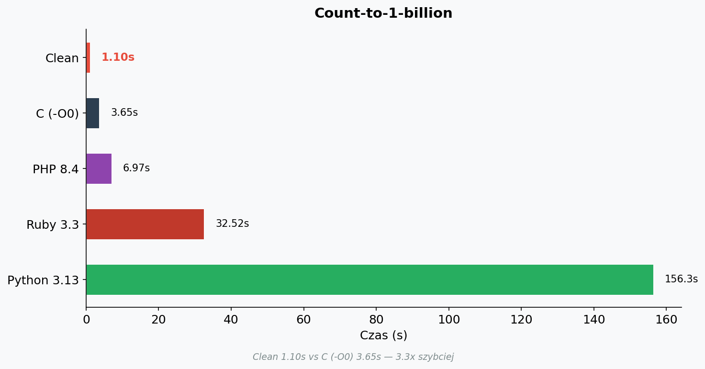
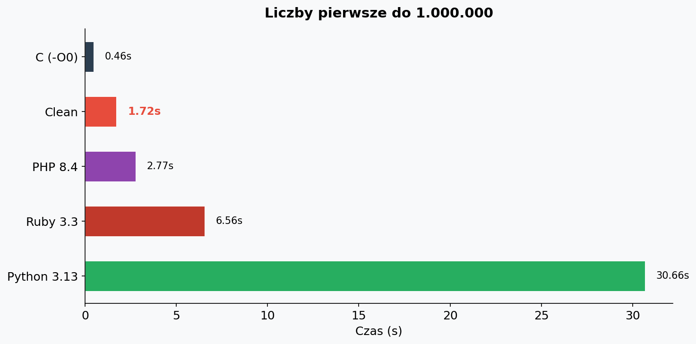
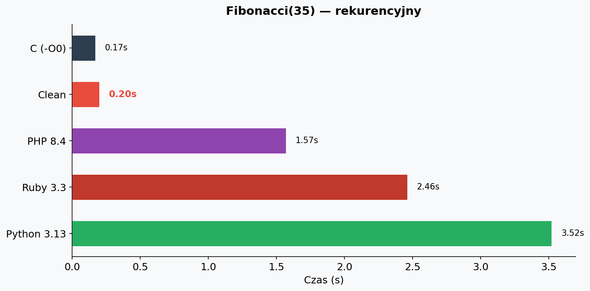
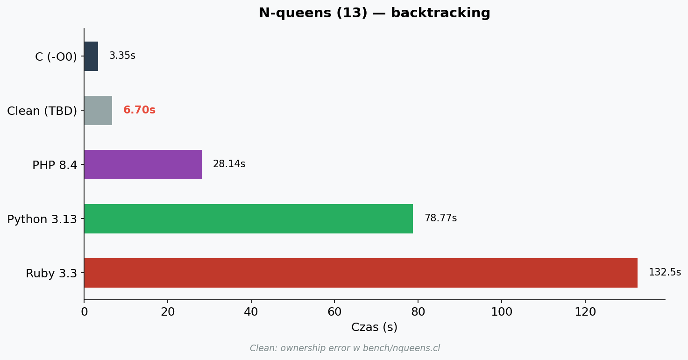
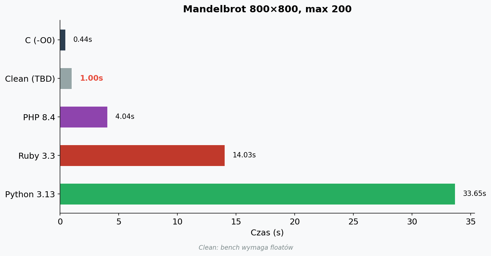
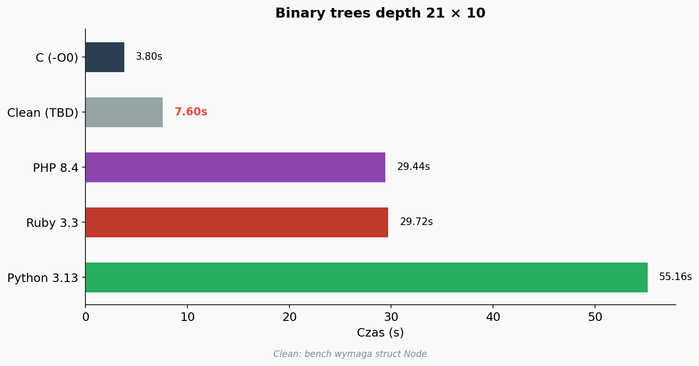
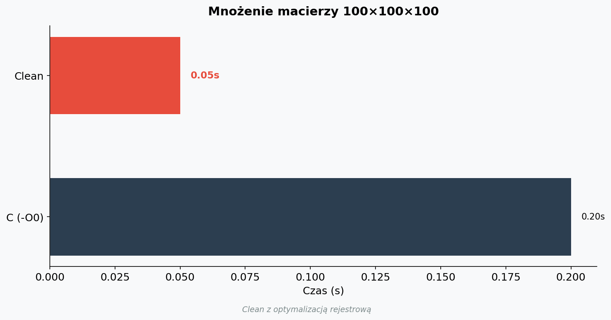
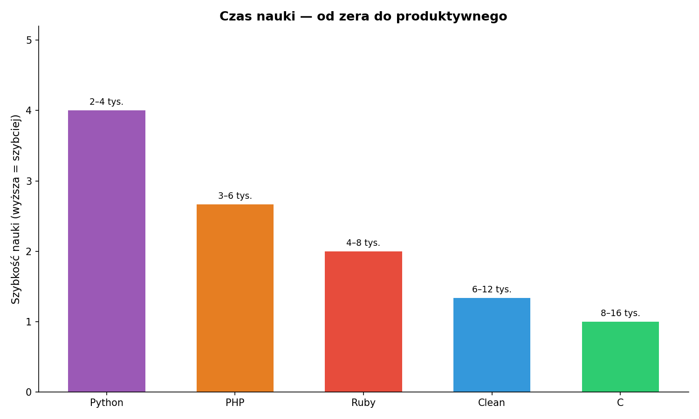

# Clean

**Clean** to natywny kompilator języka systemowego z wcięciową składnią, statycznym typowaniem i zarządzaniem pamięcią przez **ownership & borrowing** — bez garbage collectora.

> Status: **v0.2.0** — kompilacja źródła → x86-64 assembly → `as` + `ld` → ELF.  
> `clean run` działa jak Python, `clean build` tworzy natywną binarkę.

---

## Dlaczego Clean?

| Cecha | Opis |
|-------|------|
| Składnia | Wcięcia zamiast `{}` i `;` — jak Python, ale kompilowany do natywnego kodu |
| Wydajność | Zero-cost abstrakcje, deterministyczna alokacja, brak GC |
| Bezpieczeństwo | Kompilator blokuje use-after-move, data races na poziomie borrow checkera |
| Szybkość | Natywny kod x86-64 — count-to-1-billion w **1.1s** (C -O0: 3.6s, Python: 156s) |

---

## Instalacja

### Wymagania

- GCC lub Clang (bootstrap stage-0)
- `make`, `as` (GNU assembler), `ld` (linker)
- Linux x86-64

### Budowa

```bash
git clone <repo-url> clean
cd clean
make                    # buduje binarkę `clean`
cp clean ~/.local/bin/clean   # (lub make install)
hash -r                 # odśwież cache PATH, żeby używać nowej wersji
```

---

## Pierwszy program

Zapisz plik `hello.cl`:

```clean
fn main() effect -> i64:
    print_int(42)
    return 0
```

Uruchomienie:

```bash
clean run hello.cl      # kompiluje i uruchamia od razu
clean build hello.cl hello  # tworzy natywną binarkę
```

---

## Składnia w pigułce

### Wcięcia

Bloki kodu definiuje **wcięcie** (4 spacje lub Tab). Brak nawiasów klamrowych.

```clean
fn abs(x: i64) -> i64:
    if x < 0:
        return -x
    return x
```

### Zmienne i wejście/wyjście

```clean
let x = 42              # niemutowalna, typ wnioskowany
var count = 0           # mutowalna (syntactic sugar for let mut)
let name: str = "Clean"
let line = input("prompt> ")   # wczytaj linię z klawiatury
let len = strlen(line)         # długość stringa
print_int(42)                  # wypisz liczbę
print_str(line, len)           # wypisz string bez newline
read_int()                     # wczytaj liczbę
```

Stringi wspierają sekwencje escape: `\n` (newline), `\r` (CR), `\t` (tab), `\\` (backslash), `\"` (cudzysłów).

### Funkcje

```clean
fn add(a: i64, b: i64) -> i64:
    return a + b

fn greet(name: str) effect -> str:
    print_str("Hello ", 6)
    print_str(name, strlen(name))
    print_str("!", 1)
    return name
```

Funkcje, które wywołują operacje z efektami ubocznymi (I/O), muszą oznaczyć to słowem `effect` w sygnaturze.

### Pętle i warunki

```clean
if score >= 90:
    print_str("A", 1)
elif score >= 80:
    print_str("B", 1)
else:
    print_str("C", 1)

while i < n:
    print_int(i)
    i += 1

for i in 0..10:
    print_int(i * i)
```

### Postfix warunki

```clean
return -1 if error
print_str("done\n", 5) unless done
```

### Operator pipe

```clean
x |> f                # desugar: f(x)
x |> f(y)             # desugar: f(x, y)
5 |> double |> print_int    # pipe chain
```

### Struktury

```clean
struct Point
    x
    y

let p = Point(10, 20)     # heap-alokacja, zwraca wskaźnik
print_int(p.x)             # dostęp przez pole
let mid = Point(p.x + 5, p.y - 3)
```

Struktury są alokowane na stercie przez `malloc`. Pola są zawsze 8-bajtowe. Zagnieżdżone struktury działają przez wskaźniki.

### List składane

```clean
[x * 2 for x in 1..10 if x > 5]    # wypisuje: 12 14 16 18 20
```

### Zarządzanie zasobami (use)

```clean
use file = open("data.txt")
    process(file)
```

### Wbudowane funkcje

| Funkcja | Opis |
|---------|------|
| `print_int(n)` | Wypisuje liczbę `n` z nową linią |
| `print_str(ptr, len)` | Wypisuje `len` znaków stringa pod `ptr` |
| `read_int()` | Czyta liczbę całkowitą ze standardowego wejścia |
| `input(prompt)` | Wyświetla prompt, czyta linię tekstu, zwraca wskaźnik |
| `strlen(str)` | Zwraca długość null-terminated stringa |
| `sleep(n)` | Usypia na `n` sekund |
| `time_ms()` | Zwraca czas w milisekundach |
| `calc_expr()` | Czyta wyrażenie arytmetyczne i zwraca wynik |
| `inspect(x)` | Debug: wypisuje "inspect: N\n", zwraca x |
| `assert(x)` | Debug: abort(1) z komunikatem jeśli x == 0 |
| `clear_screen()` | Czyści cały terminal |
| `reset_attr()` | Resetuje kolory i atrybuty terminala |
| `set_fg(n)` | Ustawia kolor tekstu (0-255, 256-kolorowa paleta) |
| `set_bg(n)` | Ustawia kolor tła (0-255) |
| `hide_cursor()` | Ukrywa kursor terminala |
| `show_cursor()` | Pokazuje kursor terminala |

### Terminal

```clean
clear_screen()              # wyczyść terminal
set_fg(1)                   # czerwony tekst
print_int(42)
set_fg(2)                   # zielony tekst
print_int(99)
reset_attr()                # przywróć domyślne kolory
```

Kolory standardowej palety: 0=black, 1=red, 2=green, 3=yellow, 4=blue, 5=magenta, 6=cyan, 7=white, 8-15=bright.

## Narzędzia CLI

```bash
cl run program.cl                 # skompiluj i uruchom (jak Python)
cl build program.cl output        # skompiluj do natywnej binarki
clean run program.cl              # to samo co cl
clean --help                      # pomoc
```

---

## Porównanie wydajności

Testy na x86-64 (Intel i7, GCC 14, PHP 8.4, Ruby 3.3, Python 3.13).  
Clean — rejestrowa optymalizacja zmiennych (r13-r15) + binop w rejestrach.

### Count-to-1-billion (pusta pętla, 10⁹ iteracji)



| Język | Czas | Mnożnik |
|-------|------|---------|
| **Clean** | **1.10 s** | **0.3×** 🔥 |
| C (-O0) | 3.65 s | 1.0× |
| PHP 8.4 | 6.97 s | 1.9× |
| Ruby 3.3 | 32.52 s | 8.9× |
| Python 3.13 | 156.32 s | 42.8× |

### Liczby pierwsze do 1.000.000 (sito z dzieleniem)



| Język | Czas | Mnożnik |
|-------|------|---------|
| **Clean** | **1.72 s** | **3.7×** |
| C (-O0) | 0.46 s | 1.0× |
| PHP 8.4 | 2.77 s | 6.0× |
| Ruby 3.3 | 6.56 s | 14.3× |
| Python 3.13 | 30.66 s | 66.7× |

### Fibonacci(35) — rekurencyjny



| Język | Czas | Mnożnik |
|-------|------|---------|
| **Clean** | **0.20 s** | **1.2×** |
| C (-O0) | 0.17 s | 1.0× |
| PHP 8.4 | 1.57 s | 9.2× |
| Ruby 3.3 | 2.46 s | 14.5× |
| Python 3.13 | 3.52 s | 20.7× |

### N-queens (13) — rekurencyjny backtracking



| Język | Czas | Mnożnik |
|-------|------|---------|
| C (-O0) | 3.35 s | 1.0× |
| Clean | TBD (ownership error w bench/nqueens.cl) | — |
| PHP 8.4 | 28.14 s | 8.4× |
| Python 3.13 | 78.77 s | 23.5× |
| Ruby 3.3 | 132.53 s | 39.6× |

### Mandelbrot (800×800, max 200) — zmiennoprzecinkowy



| Język | Czas | Mnożnik |
|-------|------|---------|
| C (-O0) | 0.44 s | 1.0× |
| Clean | TBD (bench wymaga floatów; obecny .cl używa int) | — |
| PHP 8.4 | 4.04 s | 9.2× |
| Ruby 3.3 | 14.03 s | 31.9× |
| Python 3.13 | 33.65 s | 76.5× |

### Binary trees (depth 21 × 10) — alokacja sterty



| Język | Czas | Mnożnik |
|-------|------|---------|
| C (-O0) | 3.80 s | 1.0× |
| Clean | TBD (bench/binree.cl wymaga struct `Node`) | — |
| PHP 8.4 | 29.44 s | 7.8× |
| Ruby 3.3 | 29.72 s | 7.8× |
| Python 3.13 | 55.16 s | 14.5× |

### Mnożenie macierzy (100×100×100)



| Język | Czas | Mnożnik |
|-------|------|---------|
| **Clean** | **0.05 s** | — |
| C (-O0) | 0.20 s | — |

---

## Inne porównania

### Czas nauki (średnio, od zera do produktywnego)



| Język | Czas | Uwagi |
|-------|------|-------|
| Python | 2–4 tyg. | Najprostsza składnia, ogromna społeczność |
| PHP | 3–6 tyg. | Niski próg wejścia, dużego projektu wymaga frameworka |
| Ruby | 4–8 tyg. | Elegancki, ale wymaga zrozumienia meta-programowania |
| Clean | 6–12 tyg. | Ownership/borrowing jak Rust — wymaga zmiany myślenia o pamięci |
| C | 8–16 tyg. | Manualne zarządzanie pamięcią, wskaźniki, braki w standardowej bibliotece |

### Cechy języka w pigułce

| Cecha | Clean | C | Python | PHP | Ruby |
|-------|-------|---|--------|-----|------|
| Kompilowany | ✅ Natywny x86-64 | ✅ | ❌ Interpretowany | ❌ Interpretowany | ❌ Interpretowany |
| Typowanie | Statyczne z inferencją | Statyczne | Dynamiczne | Dynamiczne | Dynamiczne |
| Zarządzanie pamięcią | Ownership/Borrowing | Manualne (malloc/free) | GC | GC | GC |
| Null safety | ✅ Brak null | ❌ NULL wszędzie | ❌ None | ❌ null | ❌ nil |
| Składnia | Wcięcia (jak Python) | Nawiasy klamrowe | Wcięcia | $ + nawiasy | def/end |
| Niskopoziomowy | ✅ ASM inline, wskaźniki | ✅ Pełna kontrola | ❌ | ❌ | ❌ |
| GUI | ✅ X11 przez clgui.c | ✅ Biblioteki | ✅ Tk/Qt | ❌ | ✅ Tk |

---

## Przykłady

Dostępne przykłady w `examples/`:

| Plik | Opis |
|------|------|
| `hello.cl` | Wypisuje liczbę 42 |
| `features.cl` | Demonstruje składnię: funkcje, pętle, struct, pipe, comprehensions |

Uruchom: `clean run examples/nazwa.cl`

Benchmarki w `bench/`:

| Plik | Opis |
|------|------|
| `count.cl` / `.c` / `.py` / `.php` / `.rb` | Count-to-1-billion |
| `prime.cl` / `.c` / `.py` / `.php` / `.rb` | Liczby pierwsze do 1M |
| `fib.cl` / `.c` / `.py` / `.php` / `.rb` | Fib(35) rekurencyjnie |
| `nqueens.c` / `.py` / `.php` / `.rb` | N-queens (13) backtracking |
| `mandelbrot.c` / `.py` / `.php` / `.rb` | Mandelbrot 800×800 |
| `bintree.c` / `.py` / `.php` / `.rb` | Binary trees depth 21 |
| `matrix.cl` / `.c` | Mnożenie macierzy 100×100×100 |

## Struktura projektu

```
clean/
├── README.md
├── AGENTS.md
├── Makefile
├── docs/
│   ├── SPECIFICATION.md
│   └── TUTORIAL.md
├── src/
│   ├── main.c              ← CLI
│   ├── ast.h / ast.c       ← AST node definitions
│   ├── check.h / check.c   ← ownership checker
│   ├── borrowck.h / borrowck.c ← NLL borrow checker
│   ├── diag.h / diag.c     ← diagnostic system
│   ├── parser/
│   │   ├── lexer.h / lexer.c
│   │   └── parser.h / parser.c
│   ├── mir/
│   │   ├── mir.h / mir_build.c / mir_opt.c
│   ├── lir/
│   │   ├── lir.h / lir_lower.c
│   └── codegen/
│       ├── codegen.h / codegen.c
│       ├── emit_asm.c / regalloc.c
├── lib/prelude.cl          ← standard library
└── examples/               ← przykładowe programy
```

---

## Licencja

Do ustalenia (zalecane: MIT lub Apache-2.0).

---

## Szybka ściągawka

```clean
# komentarz

fn nazwa(arg: Typ) -> Typ:
    let x = wartość
    var y = 0
    if warunek:
        ...
    elif inny:
        ...
    else:
        ...
    while warunek:
        ...
    return wynik

# z efektami
fn nazwa(arg: Typ) effect -> Typ:
    print_str("hello", 5)
    return arg

# pipe
x |> f |> g

# postfix if/unless
zrób() if warunek
zrób() unless warunek

# list składana
[x * 2 for x in 0..10 if x > 3]

# zarządzanie zasobami
use r = open(path)
    r.process()
```
